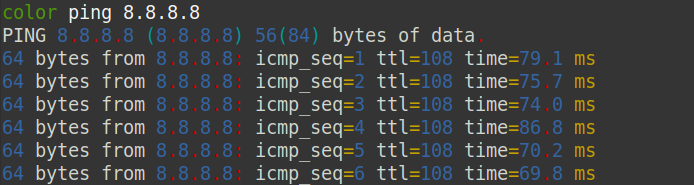
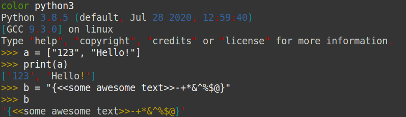

# Terminal Prettifier
This is terminal output highliter with customizable config. If you ever wanted to have a prettier ping
command or prettier interactive shells output, it's a script for you! just add `color` to the begining of
the command you want to execute, and bam! It's so PRETTIER now.

### Example Ping


### Example Python


## Installation
Clone this library and add the `color` bash file as an alias to your environment variables.
```bash
alias color=`bash /PATH-TO-THIS-LIBRARY/TerminalPrettifier/color`
```
Then open new terminal and use color before command you want to use.
You need to have `python3` in your path. compatibility tested for `python >= 3.6`. You can also change the
python name at the bottom of the page in `color` bash file by yourself:
```bash
eval $command 2>&1 | python3 $py_exe
```
## Configuration
You can edit the configuration file and customize it. The config file is placed in the root directory
of the TerminalPrettifier folder named `.prettifier_cfg`. You can change the colors of each section and 
and set it to one of color names provided in `src/colors.py`. Colors list are as follow:
* Green
* Blue
* Red
* Cyan
* Magenta
* Yellow
* Black
* White

You can define special names painting with keyword **SN** in the config file. Also you can choose how you want to paint the word with a sequence of first letter of colors in uppercase foramt. For example if you want to change *shamir0xe* into red and blue, you can add something like this to the config:

    SN shamir0xe RB

then the output should be like this:
<pre><font color="#4E9A06">color</font> echo shamir0xe  
<font color="#CC0000">s</font><font color="#3465A4">h</font><font color="#CC0000">a</font><font color="#3465A4">m</font><font color="#CC0000">i</font><font color="#3465A4">r</font><font color="#CC0000">0</font><font color="#3465A4">x</font><font color="#CC0000">e</font>
</pre>

You can specify more colors to the text you want to highlight, by adding more letters to the color section.
For example this could be use for painting every letter with every color we have:

    SN shamir0xe GBRCMYW

then output should be something like this:
<pre><font color="#4E9A06">color</font> echo shamir0xe
<font color="#06989A">s</font><font color="#75507B">h</font><font color="#4E9A06">a</font><font color="#CC0000">m</font><font color="#D3D7CF">i</font><font color="#C4A000">r</font><font color="#3465A4">0</font><font color="#06989A">x</font><font color="#75507B">e</font>
</pre>

As you see, the program shuffles the list of the colors for each config when it wants to print them. This is
added for fun, and will be optional in the next releases.
