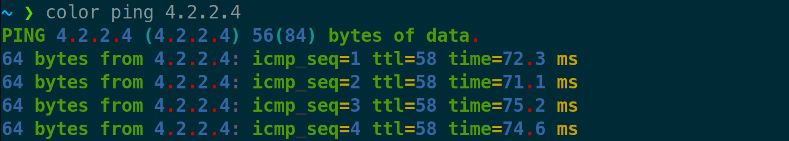

<h1 align="center" style="display: block; font-size: 2.5em; font-weight: bold; margin-block-start: 1em; margin-block-end: 1em;">
<a name="logo" href="#"></a>
</h1>


&nbsp;&nbsp;&nbsp;&nbsp;&nbsp;&nbsp;&nbsp;&nbsp;&nbsp;&nbsp;&nbsp;&nbsp;&nbsp;&nbsp;&nbsp;&nbsp;

[](https://opensource.org/licenses/MIT)

A tool to make your terminal more prettier!

### Table of Contents
- [Terminal Prettifier](#terminal-prettifier)
    - [Example Ping](#example-ping)
    - [Example Python](#example-python)
- [Installation](#installation)
- [Configuration](#configuration)

# Terminal Prettifier
This is a terminal output highlighter with a customizable config. If you ever wanted to have a prettier ping command or prettier interactive shells output, it's a script for you! just add `color` to the beginning of the command you want to execute, and bam! It's so PRETTIER now.


### Example Ping
<p align="center"></p>

### Example Python
<p align="center"></p>

# Installation
Clone this library and add the `color` alias to your `~/.bash_aliases` as an environment variable.
```bash
alias color='bash /PATH-TO-THIS-LIBRARY/terminal-prettifier/color'
```

Then open a new terminal and use `color` before the command you want to use.
You need to have `python3` in your path. You can also change the python name at the bottom of the page in the `color` bash file by yourself:
```bash
python3 $py_exe
```


# Configuration
You can edit the configuration file and customize it. The config file is placed in the `configs` directory of the `terminal-prettifier` folder named `user.json`. You can change the colors of each section and set it to one of the color names provided in `src/types/colors.py`. The colors list are as follow:
* Green
* Blue
* Red
* Cyan
* Magenta
* Yellow
* Black
* White

You can define special colors for individual names you provided in `specific_names` section of `user.json` file. Also you can choose how you want to paint the word with a sequence of first letter of colors in a single string. For example if you want to change *shamir0xe* into red and blue, you can add something like this to the config:

```
user.json
{
    ...,
    "specific_names": {
        ...,
        ["shamir0xe", "RYC"]
    }
}
```

output:

<p align="center"></p>

You can specify more colors to the text you want to highlight, by adding more letters to it's section.
